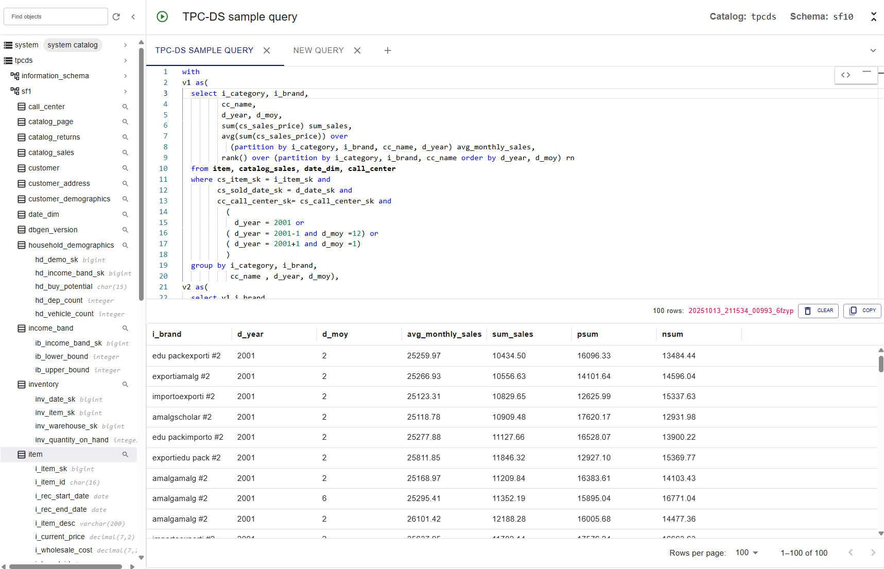

# Trino Query UI

A reusable React component as a query interface for the SQL query engine
[Trino](https://trino.io/). Browse connected catalogs, write SQL queries,
execute the queries and inspect result data all in a web application connected
to your Trino cluster.

The component can be embedded into any React application and configured to proxy
requests to a local or remote Trino cluster.



Implementation details:

* React TypeScript project with Vite
* Uses Node.js v24+
* Monaco editor + ANTLR parser using the Trino language

## Features

* Browse metadata about catalogs, schemas, tables, and more
* Search across catalogs
* Set queries session context.
* Inspect data with generated queries
* Preview sample data
* Write queries manually with schema-aware SQL syntax completion and
  highlighting
* Use multiple query tabs
* View schema information in SQL queries via mouse-over hovering
* Format SQL queries in the editor
* Copy result set table data to the clipboard
* Monitor query processing across the Trino cluster

See details in the [demo animation](./demos.gif).

## Authentication limitation

The current default setup expects Trino to accept unauthenticated requests.
Query UI submits queries to `/v1/statement` with the hardcoded SQL identity
`X-Trino-User: system`. This header selects a user; it does not authenticate
the request. This limitation applies independently of whether Query UI runs
through the Vite development server or is embedded in a built application.

Query UI cannot currently reuse an authenticated Trino Web UI session. The
Web UI's form/OAuth cookies are scoped to `/ui`, and `/v1/statement` uses
client authentication rather than Web UI authentication. As a result, queries
can fail with `401 Unauthorized` even when the user is logged into the Web UI.

See [issue #61](https://github.com/trinodb/trino-query-ui/issues/61) for further
details and planned support for Web UI session reuse.

## Installation

```shell
npm install @trinodb/trino-query-ui
```

The component shares React, Emotion, MUI, and the Monaco editor with the
application it is embedded into, so those libraries are peer dependencies
instead of bundled copies. A single shared instance of each keeps the embedding
application from shipping two React runtimes or two MUI theme contexts:

* `react` and `react-dom`
* `@emotion/react` and `@emotion/styled`
* `@mui/material` and `@mui/icons-material`
* `@mui/x-data-grid` and `@mui/x-tree-view`
* `@monaco-editor/react`
* `monaco-editor`, optional and only needed to supply your own editor instance

npm installs peer dependencies automatically. Add them to the embedding
application explicitly when it pins its own versions of these libraries.

## Quick start

```tsx
import { QueryEditor } from '@trinodb/trino-query-ui'

function MyTrinoApp() {
  return <QueryEditor theme="dark" height={800} />
}

export default MyTrinoApp
```

All styling comes from MUI and Emotion at runtime, so there is no stylesheet to
import.

### Supplying the Monaco editor

The query editor renders through `@monaco-editor/react`, which downloads Monaco
from a content delivery network unless the application supplies an instance.
Configure the loader once during startup to reuse an instance the application
already has, and to keep the deployment free of external requests:

```tsx
import { loader } from '@monaco-editor/react'
import * as monaco from 'monaco-editor'
import EditorWorker from 'monaco-editor/editor/editor.worker?worker'

self.MonacoEnvironment = { getWorker: () => new EditorWorker() }

loader.config({ monaco })
```

Import `monaco-editor` or `monaco-editor/editor/editor.main`. Both register the
standalone editor contributions. The bare `monaco-editor/editor` entry point
exposes only the API, and an editor built from it has no suggest widget, so the
schema-aware autocomplete never appears.

Both of those entry points also register the language services for JSON, CSS,
HTML, and TypeScript, which run in web workers. Monaco resolves the worker
through `MonacoEnvironment`, and leaving it unset throws an uncaught error at
startup on every page load. The Trino SQL language runs entirely on the main
thread, so returning the generic editor worker is enough unless the application
edits those other languages too. The `?worker` suffix is Vite syntax. Other
bundlers spell the worker import differently.

## Development

### Build and run

1. Install Node.js (v24 or newer) from <https://nodejs.org/en/download/>
2. Ensure Trino is running at the configured URL. Defaults to http://localhost:8080.
   The default setup requires unauthenticated access; see the
   [authentication limitation](#authentication-limitation).
3. Install the dependencies and run the dev server:

```shell
npm install
npm run dev
```

The local URL is displayed, and you can open it in your browser.

### Building the parser

Build the parser, as configured in **package.json**.

```shell
npm run antlr4ng
```

### Linting and code formatting

To check code quality and formatting with ESLint and Prettier, as defined in
**package.json**:

```shell
npm run check
```

### Dependency management

The `dependencies` and `devDependencies` are pinned to exact versions rather
than to caret ranges. The lockfile already pins the versions used to build this
repository, so exact pins add two things on top of it. Every dependency update
becomes a visible change to **package.json** that is easy to review and merge,
and the declared version always equals the version that is actually built and
tested, with no room for a range to resolve to something else.

The query editor is embedded into the
[Trino web UI](https://github.com/trinodb/trino/tree/master/core/trino-web-ui),
which supplies the shared React, Emotion, MUI, and Monaco libraries at runtime.
Those shared runtime libraries are kept in lockstep with the web UI so the embed
ships a single instance of each, and the build toolchain is kept close for
consistency. The authoritative reference is the
[web UI manifest](https://github.com/trinodb/trino/blob/master/core/trino-web-ui/src/main/resources/webapp/package.json)
on the Trino default branch.

`npm run sync:check` compares the shared packages against that manifest. It fails
when a shared runtime library drifts and only warns on the build toolchain, which
does not affect the embed at runtime. The
[dependency sync workflow](.github/workflows/dependency-sync.yml) runs the same
check on every pull request and weekly.

The `peerDependencies` are the exception. They stay as wide ranges rather than
exact pins, because they are the contract with the embedding application.
Narrowing them would force an unmet peer dependency on any embedder running a
slightly older but compatible release, so they declare the widest range the
component genuinely supports.

Dependabot keeps the pins current. It groups the React and MUI stack and the
build toolchain into one pull request each, and rewrites the exact pin on every
update. It ignores major version bumps on the shared packages, so the component
never runs ahead of the web UI on a major. Major upgrades are deliberate and
land only when the web UI adopts them, or as a separate, reviewed change.

### Versioning

Every release increments the major version. Version 1.0.0 is followed by 2.0.0,
then 3.0.0, with no compatibility implied between them. The scheme mirrors the
way Trino itself numbers releases, and it sets the expectation that each version
is its own upgrade. Read the release notes rather than the version number to
find out what changed.

The peer dependency ranges and the embedding contract are still moving, so patch
and minor guarantees would be promises this project breaks on the next release.

### Releasing a new version

Releases are automated. The [release
workflow](.github/workflows/release.yml) runs on every push to `main`. When it
detects a changed version in **package.json**, it publishes the package
to npm and then creates a GitHub release with generated release notes. Pushes
that leave the version untouched publish nothing.

Publishing runs before the release is created, so a failed publish leaves
neither a release nor a tag behind, and the workflow run can be repeated once
the cause is fixed.

Bump the version from the repository root:

```shell
npm version 2.0.0 --no-git-tag-version
```

Use `npm version` instead of editing **package.json** by hand, so that
**package-lock.json** records the same version. The two files drift apart
otherwise, because the release workflow installs with `npm ci`, which never
writes to the lockfile. The `--no-git-tag-version` flag skips the commit and
tag, since the workflow creates the tag from the merged commit.

Commit both changed files with a `Release v2.0.0` message, open a pull request,
and merge it after review. The new version then appears on
[npm](https://www.npmjs.com/package/@trinodb/trino-query-ui).

Publishing uses [npm trusted
publishing](https://docs.npmjs.com/trusted-publishers/) with OpenID Connect, so
no npm token is stored in this repository. npm verifies the workflow identity
directly and attaches a provenance attestation to each published version. The
trusted publisher is configured in the package settings on npmjs.com and must
match this repository and the **release.yml** workflow file name.

A brand new package name is the one case this does not cover. Trusted publishing
needs an existing package to attach its configuration to, so the first version
under a new or renamed package name has to be published by a maintainer with npm
access before the workflow can take over.

## Philosophy

This UI's purpose is to provide an environment where, once the cluster is up,
you can immediately execute queries and explore data sets. The intended use
cases are:

* Initial proof-of-concept queries.
* Exploration of data sets.
* Performance analysis.
* Ad hoc query execution.
* Quickly enabling a data engineering team to start work before other
  integrations are in place.
* Early demos.

The approach:

1. Direct integration into the Trino UI
    - Reusing the Web UI login and executing queries as the authenticated user
      are planned; see the [authentication limitation](#authentication-limitation)
    - Trino does the heavy lifting
2. Remove friction so you can simply write a query
    - Autocomplete understands the Trino language, tables, and columns
    - Provides syntax highlighting and validation
    - Offers a comprehensive catalog explorer
3. Avoid black-box query execution
    - Show progress and execution details. People ask "why is my query slow?"
      mostly because they only see a spinner for minutes.
    - Link to the Trino Query UI to drill into query performance
    - Show stages and split counts like the Trino console client
4. Keep the experience easy to navigate

### Gaps and future direction

* Saving queries and using source control require either backend capabilities
  in the Trino service or leveraging Trino to write queries as tables.
* No autocomplete for the Trino function list.
* Basic graphing capabilities are still missing—looking at a table alone is
  not enough even for inspecting data sets.
* No LLM copilot integration yet. Many query UIs implement this poorly, but,
  done well, it could make query crafting fast and help translate from other
  query languages.
* Parameters and string replacement are only partly implemented in
  `SubstitutionEditor` and should support both SQL parameters and string
  replacement.
